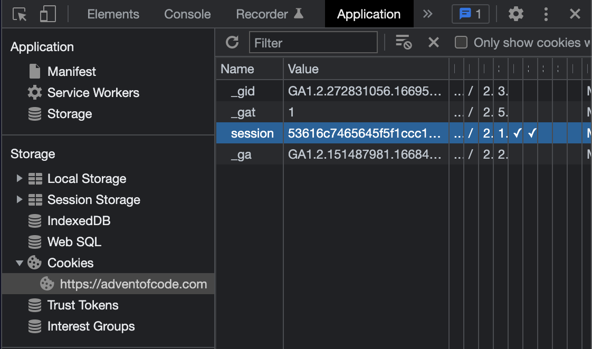

<h1 align="center">
	Template for solving 🌟 Advent of Code 🎄
</h1>

<p align="center">
	
	
	
	
	
</p>

<h3 align="center">
	<a href="#%EF%B8%8F-about">About</a>
	<span> · </span>
	<a href="#%EF%B8%8F-usage">Usage</a>
	<span> · </span>
	<a href="#-contents">Contents</a>
	<span> · </span>
	<a href="#-what-is-advent-of-code">What is <i>Advent of Code</i>?</a>
</h3>

---

## 🗣️ About

This template was developed for solving 🌟 Advent of Code 🎄 puzzles. It includes a [framework](https://github.com/appinha/aoc_framework) for automating repetitive tasks and a [library](https://github.com/appinha/aoc_lib) with useful tools for solving the puzzles.

## 🛠️ Usage

### Requirements

- `Python 3.10`
- `termcolor`
- `make` (for running `Makefile`)

### Instructions

**0. Create a new repo from this template, git clone it and start submodules**

To create a new repo from this template, click on "Use this template", then on "Create a new repository":


After creating a new repository from this template, git clone it and start submodules:

```shell
$ git clone <your_cloned_repo.git>
$ cd your_cloned_repo
$ git submodule update --init
```

**1. Configure the config.ini file**

To enable automated downloading of your personal input from the AoC website, on the `my_solutions/config.ini` file, fill in the **year** of the AoC edition you will be solving and your personal **session cookie**.

_**Note:** to get your session cookie, open the AoC website and log in to your account; open DevTools (inspect) and go to the "Application" tab; on the left menu, under "Storage", click on "Cookies", then on the AoC url; from the table, copy the value of the "session" entry._



**2. Create a new day folder from template**

```shell
$ make new d=01
```


_Note: the `make` commands have to be run from the cloned folder's root, i.e. from where the `Makefile` is placed._

The resulting folder structure will be:
```
your_cloned_repo
  my_solutions
    aoc_framework
      ...
    aoc_lib
      ...
    config.ini
    day_01
      input_test.txt
      input.txt
      main.py
      README.md
      solutions.txt
  Makefile
```

**3. Fill in the input files**

For your **personal input**, upon creating a new day folder from template, it is automatically downloaded from the AoC website and pasted into the `input.txt` file.

If an error occurred while downloading your input upon creating the new day folder, you can try again with:

```shell
$ make input d=01
```

For **testing inputs**, add them in the `input_test.txt` file in substitution of the text `INPUT` and add the expected result in substitution of the `?` character. The line `<--->` is used to separate inputs for a given puzzle part, while the line `<===>` separates inputs from each puzzle part. In the example below, there are 3 testing inputs for part 1 and 2 testing inputs for part 2:

```
2x3x4
:-> solution=58 <-:

<--->

1x1x10
:-> solution=43 <-:

<--->

2x3x4
1x1x10
:-> solution=101 <-:

<===>

2x3x4
:-> solution=34 <-:

<--->

1x1x10
:-> solution=14 <-:
```

_(test inputs for AoC 2015 day 02 puzzle)_

**4. Write the solving code in the `main.py` file**

The solving code for each part of the puzzle have to be written as the methods `solve_part_1` and `solve_part_2` of the `DayPuzzleSolver` class:

```python
class DayPuzzleSolver():
    def __init__(self):
        self.delimiter = ""

    def solve_part_1(self, raw_input):
        ...

    def solve_part_2(self, raw_input):
        ...
```

The `self.delimiter` parameter determines how the text from the input file should be broken down. The result is then passed as the `raw_input` parameter of the solving methods. For example:

- `""` (empty string) - the input text remains the same, i.e. `raw_input` will be a string containing the input text in whole, for example, [AoC 2015 day 1](https://adventofcode.com/2015/day/1):
```
(((())))()((((((((())()
```

- `"\n"` - to be used when the input should be broken down line by line, i.e. `raw_input` will be a list of strings (lines), for example, [AoC 2015 day 2](https://adventofcode.com/2015/day/2):
```
20x3x11
15x27x5
6x29x7
```

- `"\n\n"` - to be used when the input is written in blocks and should be broken down by so, i.e. `raw_input` will be a list of strings (blocks of lines), for example, [AoC 2020 day 4](https://adventofcode.com/2020/day/4):
```
cid:83 pid:524032739 iyr:2013 ecl:amb byr:1974
hgt:191cm hcl:#ceb3a1 eyr:2028

ecl:gry hcl:eefed5 pid:88405792 hgt:183cm cid:221 byr:1963 eyr:2029

pid:777881168 ecl:grn
hgt:181cm byr:1923 eyr:2021 iyr:2018 hcl:#18171d

```

**5. Run the puzzle solver**

for a certain day (both parts):

```shell
$ make d=02
```


for a certain day and part:

```shell
$ make d=04 p=1
```

```shell
$ make d=08 p=2
```

for testing input:

```shell
$ make test d=12
```

```shell
$ make test d=12 p=1
```


## 📑 Contents

* `config.ini` - needed for downloading your personal input from the AoC website.
* `Makefile` - used for duplicating the day template folder and running the solver script for a given day.

### 📂 aoc_framework

A framework to automate repetitive tasks when solving the puzzles. For more information, refer to the [framework repo](https://github.com/appinha/aoc_framework).

### 📂 aoc_lib

A library with useful tools for solving the puzzles. For more information, refer to the [lib repo](https://github.com/appinha/aoc_lib).

### 📂 day_template

* `input_test.txt` - text file containing input from tests given in the puzzle.
* `input.txt` - text file containing my personal input for the puzzle.
* `main.py` - Python class that implements the code for solving the puzzle.
* `README.md` - markup file containing a summary and link to the puzzle.
* `solutions.txt` - text file containing the solutions for my personal puzzle input.

## 🌟 What is *Advent of Code*?

	🚀 TLDR: an online event where a two-part programming puzzle is released each day from Dec 1st to the 25th.

[Advent of Code](http://adventofcode.com) is an online event created by [Eric Wastl](http://was.tl/). In his words:

> Advent of Code is an Advent calendar of small programming puzzles for a variety of skill sets and skill levels that can be solved in any programming language you like. People use them as a speed contest, interview prep, company training, university coursework, practice problems, or to challenge each other.

Source: https://adventofcode.com/about
